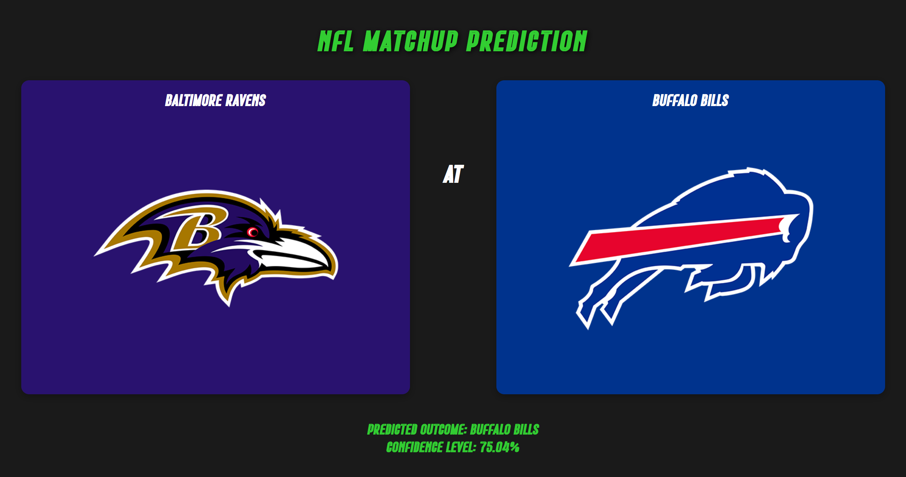

# Football Forecaster

Football Forecaster is a web application that predicts the outcome of football matches based on historical data.
The application uses a machine learning model to predict the outcome of football matches. 
The model is trained on historical NFL data from ESPN's API.



### Structural Overview

Football Forecaster consists of three main components:
1. A TypeScript-based ETL pipeline that fetches data from ESPN's API transforms it, and stores it in a MySQL database
2. A Python-based Flask microservice that trains and queries a logistic regression model to predict the outcome of football matches
3. A Java/Spring Boot backend that serves the HTML/CSS/JS frontend and interfaces with ESPN's API to fetch real-time team stats and query the Flask microservice

### Setup + Running

1. Clone this repository
2. Install node dependencies by running `npm install` in the `./scripts` directory
3. Ensure that you have [MySQL Server 8.0](https://dev.mysql.com/downloads/mysql/8.0.html) installed and running on your machine
4. Create a file titled `.env` in the root directory of the project. This file should contain your MySQL configuration details. Here's a template you can use:

```env
MYSQL_USER=<your_mysql_username>
MYSQL_PASSWORD=<your_mysql_password>
MYSQL_HOST=localhost
MYSQL_PORT=3306
API_BASE_URL=https://site.api.espn.com/apis/site/v2/sports/football/nfl/
BOXSCORE_REQ_DELAY_LEVEL=1
```
BOXSCORE_REQ_DELAY_LEVEL can be any integer between 0 and 3. Adjust this if requests to ESPN's API are being throttled.
The higher the number, the longer the delay between requests. Defaults to 1 if not specified.

5. Open a terminal in the `./scripts` directory and run `npm run build` to compile the TypeScript files, run the
script to initialize the database, and populate it with data from ESPN. This script will take a while to run, and you may
need to retry it if it fails. Sometimes, ESPN throttles requests or fails to respond to some since we are making a large
amount. If the script fails multiple times, try increasing the BOXSCORE_REQUEST_DELAY_LEVEL in the `.env` file.
7. Run `npm run export` to export the data from the database to a CSV file. This file will be used to train the machine learning model.
9. Ensure that you have [Python](https://www.python.org/downloads/) installed by running `python --version
10. Install the necessesary python dependences by running `pip install -r model/requirements.txt`
11. Ensure that you have Java installed. Verify this by running `java -version` in your terminal.
12. Make sure that in your IDE, the project is using JDK 21
13. Resolve all dependencies for the Spring Boot application by running `./mvnw clean install`
14. Run the resulting compiled Java application with `./mvnw spring-boot:run` or `java -jar target/football-forecaster-0.0.1-SNAPSHOT.jar`
15. Use the web application by navigating to http://localhost:8080 in your browser

If you need to retrain the model, delete `pipeline.pkl` in `/model` and rerun the application


